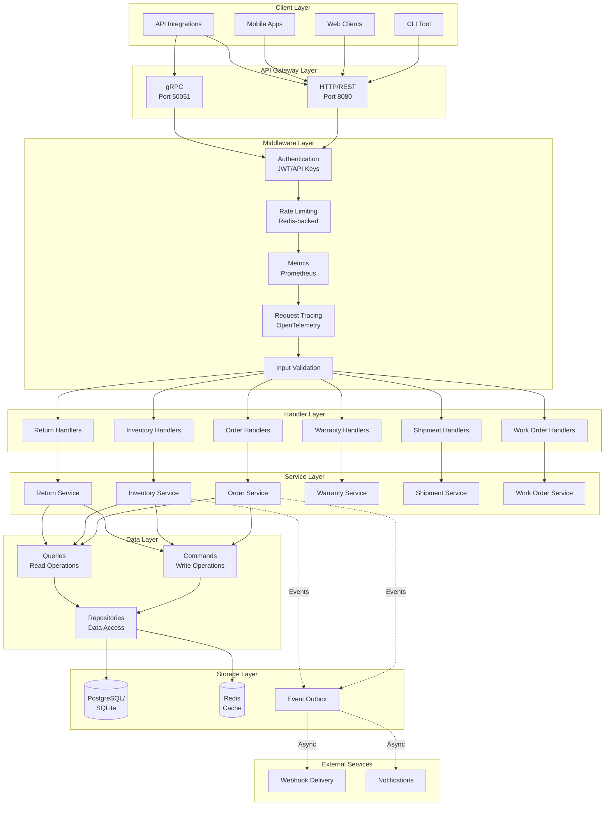
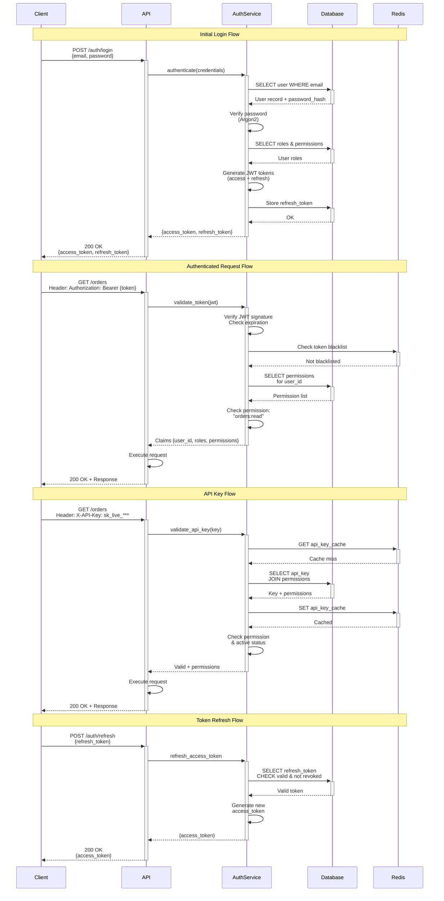
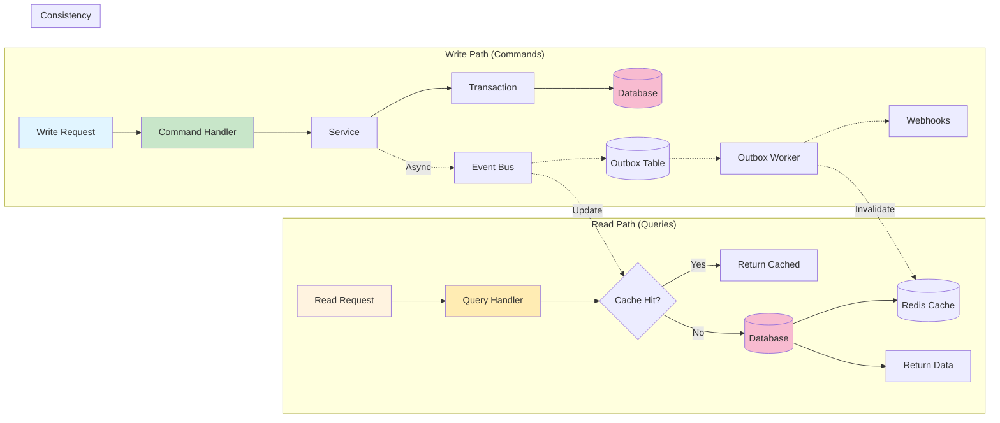
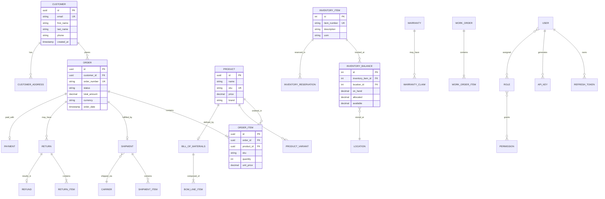
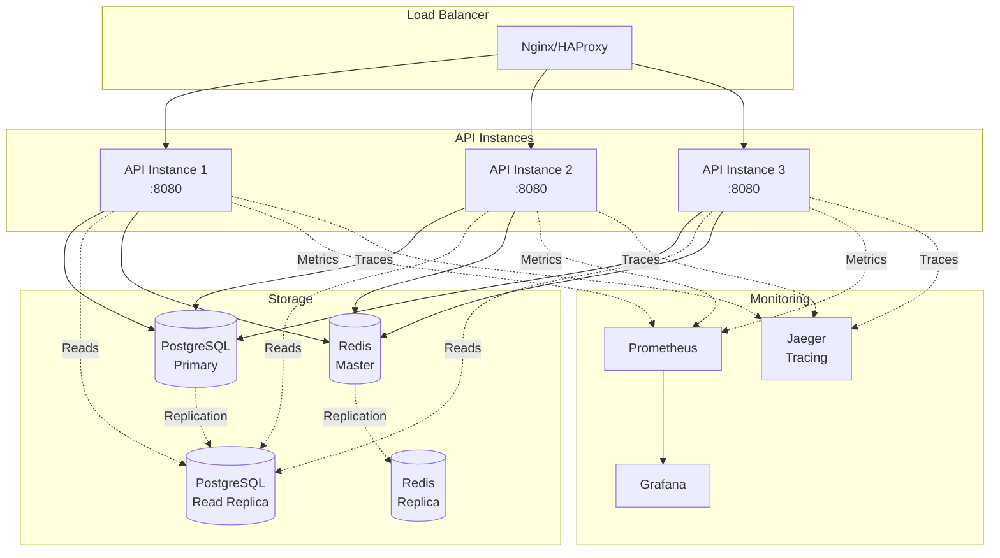

# StateSet API Architecture

This document provides visual architectural diagrams and detailed explanations of the StateSet API system design.

## Table of Contents

- [System Overview](#system-overview)
- [Authentication Flow](#authentication-flow)
- [Order Fulfillment Flow](#order-fulfillment-flow)
- [Data Flow Architecture](#data-flow-architecture)
- [Component Relationships](#component-relationships)

---

## System Overview

The StateSet API follows a layered architecture with clear separation of concerns:

### Key Architectural Patterns

1. **Layered Architecture**: Clear separation between handlers, services, and data access
2. **CQRS Pattern**: Separate command (write) and query (read) operations
3. **Repository Pattern**: Abstraction layer for data access
4. **Event-Driven**: Asynchronous event processing with outbox pattern
5. **Middleware Composition**: Composable cross-cutting concerns

---

## Authentication Flow

StateSet API supports multiple authentication methods with a robust security model:

### Security Features

- **Argon2 Password Hashing**: Industry-standard password hashing with salt
- **JWT with Refresh Tokens**: Short-lived access tokens (1 hour) + long-lived refresh tokens (24 hours)
- **Token Blacklisting**: Redis-backed revocation for immediate token invalidation
- **API Key Management**: Scoped API keys with fine-grained permissions
- **Permission-Based Access Control**: Role-based with wildcard support (e.g., `orders:*`)
- **Rate Limiting**: Per-user, per-API-key, and per-path rate limits

---

## Order Fulfillment Flow

Complete end-to-end order processing workflow:

```mermaid
sequenceDiagram
    participant Customer
    participant API
    participant OrderService
    participant InventoryService
    participant ShipmentService
    participant PaymentService
    participant Database
    participant EventBus
    participant Webhook

    Note over Customer,Webhook: Order Creation
    Customer->>+API: POST /orders<br/>{customer_id, items[]}
    API->>+OrderService: create_order_with_items()
    OrderService->>+Database: BEGIN TRANSACTION
    Database-->>-OrderService: Transaction started

    OrderService->>OrderService: Validate order<br/>- Items not empty<br/>- Amount > 0<br/>- Valid customer
    OrderService->>+Database: INSERT INTO orders
    Database-->>-OrderService: Order created
    OrderService->>+Database: INSERT INTO order_items
    Database-->>-OrderService: Items created

    OrderService->>+Database: COMMIT TRANSACTION
    Database-->>-OrderService: Committed
    OrderService->>+EventBus: Publish OrderCreated event
    EventBus-->>-OrderService: Event queued
    OrderService-->>-API: OrderResponse
    API-->>-Customer: 201 Created

    EventBus->>+Webhook: POST webhook_url<br/>{event: "order.created"}
    Webhook-->>-EventBus: 200 OK

    Note over Customer,Webhook: Inventory Reservation
    API->>+OrderService: POST /orders/{id}/process
    OrderService->>+InventoryService: reserve_inventory()<br/>for each item
    InventoryService->>+Database: BEGIN TRANSACTION
    Database-->>-InventoryService: Transaction started

    loop For each order item
        InventoryService->>+Database: SELECT inventory_balance<br/>WHERE item_id AND location<br/>FOR UPDATE
        Database-->>-InventoryService: Current balance

        alt Sufficient inventory
            InventoryService->>InventoryService: Check: available >= quantity
            InventoryService->>+Database: UPDATE inventory_balance<br/>SET allocated += quantity
            Database-->>-InventoryService: Updated
            InventoryService->>+Database: INSERT reservation record
            Database-->>-InventoryService: Reservation created
        else Insufficient inventory
            InventoryService->>+Database: ROLLBACK
            Database-->>-InventoryService: Rolled back
            InventoryService-->>OrderService: Error: Insufficient stock
            OrderService-->>API: 409 Conflict
        end
    end

    InventoryService->>+Database: COMMIT TRANSACTION
    Database-->>-InventoryService: Committed
    InventoryService->>+EventBus: Publish InventoryReserved event
    EventBus-->>-InventoryService: Event queued
    InventoryService-->>-OrderService: Reservations confirmed
    OrderService-->>-API: 200 OK

    Note over Customer,Webhook: Payment Processing
    API->>+PaymentService: process_payment()<br/>{order_id, amount}
    PaymentService->>PaymentService: Process payment<br/>(external gateway)
    alt Payment successful
        PaymentService->>+OrderService: update_payment_status<br/>("paid")
        OrderService->>+Database: UPDATE orders<br/>SET payment_status = 'paid'
        Database-->>-OrderService: Updated
        OrderService->>+EventBus: Publish OrderPaid event
        EventBus-->>-OrderService: Event queued
        OrderService-->>-PaymentService: Updated
        PaymentService-->>API: 200 OK
    else Payment failed
        PaymentService->>+InventoryService: release_reservation()<br/>for order items
        InventoryService->>+Database: UPDATE inventory_balance<br/>SET allocated -= quantity
        Database-->>-InventoryService: Released
        InventoryService-->>-PaymentService: Inventory released
        PaymentService->>+OrderService: update_status("cancelled")
        OrderService-->>-PaymentService: Updated
        PaymentService-->>API: 402 Payment Required
    end

    Note over Customer,Webhook: Shipment Creation
    API->>+ShipmentService: create_shipment()<br/>{order_id, items[]}
    ShipmentService->>+Database: INSERT INTO shipments
    Database-->>-ShipmentService: Shipment created
    ShipmentService->>ShipmentService: Assign carrier<br/>Generate tracking
    ShipmentService->>+Database: UPDATE shipments<br/>SET tracking_number
    Database-->>-ShipmentService: Updated
    ShipmentService->>+OrderService: update_order()<br/>{tracking_number}
    OrderService->>+Database: UPDATE orders<br/>SET tracking_number,<br/>status = 'processing'
    Database-->>-OrderService: Updated
    OrderService-->>-ShipmentService: Updated
    ShipmentService->>+EventBus: Publish ShipmentCreated event
    EventBus-->>-ShipmentService: Event queued
    ShipmentService-->>-API: ShipmentResponse

    Note over Customer,Webhook: Mark as Shipped
    API->>+ShipmentService: POST /shipments/{id}/ship
    ShipmentService->>+Database: UPDATE shipments<br/>SET status = 'shipped',<br/>shipped_at = NOW()
    Database-->>-ShipmentService: Updated
    ShipmentService->>+InventoryService: allocate_inventory()<br/>(deduct from on_hand)
    InventoryService->>+Database: UPDATE inventory_balance<br/>SET on_hand -= quantity,<br/>allocated -= quantity
    Database-->>-InventoryService: Updated
    InventoryService->>+EventBus: Publish InventoryAllocated event
    EventBus-->>-InventoryService: Event queued
    InventoryService-->>-ShipmentService: Inventory allocated
    ShipmentService->>+OrderService: update_status("shipped")
    OrderService->>+Database: UPDATE orders<br/>SET status = 'shipped',<br/>fulfillment_status = 'fulfilled'
    Database-->>-OrderService: Updated
    OrderService->>+EventBus: Publish OrderShipped event
    EventBus-->>-OrderService: Event queued
    OrderService-->>-ShipmentService: Updated
    ShipmentService-->>-API: 200 OK

    EventBus->>+Webhook: POST webhook_url<br/>{event: "order.shipped", tracking}
    Webhook-->>-EventBus: 200 OK
    EventBus->>+Customer: Email/SMS notification<br/>"Your order has shipped!"
    Customer-->>-EventBus: Received

    Note over Customer,Webhook: Delivery Confirmation
    ShipmentService->>+ShipmentService: Carrier webhook callback
    ShipmentService->>+Database: UPDATE shipments<br/>SET status = 'delivered',<br/>delivered_at = NOW()
    Database-->>-ShipmentService: Updated
    ShipmentService->>+OrderService: update_status("delivered")
    OrderService->>+Database: UPDATE orders<br/>SET status = 'delivered'
    Database-->>-OrderService: Updated
    OrderService->>+EventBus: Publish OrderDelivered event
    EventBus-->>-OrderService: Event queued
    OrderService-->>-ShipmentService: Updated
    EventBus->>+Webhook: POST webhook_url<br/>{event: "order.delivered"}
    Webhook-->>-EventBus: 200 OK
```

### Workflow Stages

1. **Order Creation**: Validate and persist order with line items in a transaction
2. **Inventory Reservation**: Reserve stock with optimistic locking
3. **Payment Processing**: Authorize and capture payment
4. **Shipment Creation**: Generate shipping labels and tracking
5. **Fulfillment**: Allocate inventory and mark as shipped
6. **Delivery**: Confirm delivery via carrier webhook

---

## Data Flow Architecture

How data flows through the system with CQRS pattern:

### CQRS Benefits

- **Scalability**: Read and write paths can scale independently
- **Performance**: Queries can use denormalized views and caching
- **Maintainability**: Clear separation of concerns
- **Flexibility**: Different models for reads vs writes

---

## Component Relationships

Entity relationships and dependencies:

---

## Deployment Architecture

Production deployment topology:

### Infrastructure Components

- **Load Balancer**: Distributes traffic across API instances
- **API Instances**: Stateless, horizontally scalable
- **PostgreSQL**: Primary for writes, replicas for read scaling
- **Redis**: Master for writes/cache, replica for failover
- **Prometheus**: Metrics collection and alerting
- **Grafana**: Metrics visualization
- **Jaeger**: Distributed tracing for request flows

---

## Technology Stack

### Core
- **Language**: Rust 1.88+
- **Web Framework**: Axum (Tokio-based)
- **ORM**: SeaORM with async support
- **Runtime**: Tokio for async operations

### Protocols
- **REST API**: Primary client interface
- **gRPC**: Service-to-service communication
- **WebSockets**: Real-time updates (future)

### Data
- **Primary Database**: PostgreSQL 15+
- **Cache/Session**: Redis 7+
- **Search**: Future: Elasticsearch integration

### Observability
- **Metrics**: Prometheus + custom registry
- **Tracing**: OpenTelemetry + Jaeger
- **Logging**: Structured JSON logs via tracing-subscriber
- **Health**: Built-in health check endpoints

### Security
- **Authentication**: JWT + API Keys
- **Password Hashing**: Argon2
- **TLS**: Rustls for HTTPS
- **Rate Limiting**: Redis-backed token bucket

---

## Performance Characteristics

### Throughput
- **Peak**: 10,000+ req/sec per instance
- **Average Response Time**: < 50ms (p50)
- **P99 Response Time**: < 200ms

### Scalability
- **Horizontal**: Stateless design for easy scaling
- **Vertical**: Efficient memory usage (~50MB baseline)
- **Connection Pooling**: Configurable pool sizes

### Reliability
- **Availability**: 99.9%+ with multi-instance deployment
- **Fault Tolerance**: Automatic retry with exponential backoff
- **Data Consistency**: ACID transactions for critical operations

---

## Future Enhancements

1. **Microservices**: Split into domain-specific services
2. **Event Sourcing**: Full event-sourced architecture
3. **GraphQL**: Add GraphQL API alongside REST
4. **Caching**: Multi-layer caching strategy
5. **Search**: Full-text search with Elasticsearch
6. **Real-time**: WebSocket support for live updates
7. **Multi-tenancy**: Tenant isolation and routing

---

*Last Updated: 2025-01-25*
